- [OBJECTIVE](#objective)
  - [CASE STUDIES](#case-studies)
  - [WHAT ABOUT INTERNAL THREATS?](#what-about-internal-threats)
- [PRIORITIZATION TABLE](#prioritization-table)
  - [EXAMPLES OF PRIORITIZATION TABLES](#examples-of-prioritization-tables)
    - [Example 1:](#example-1)
    - [Example 2:](#example-2)
    - [Example 3:](#example-3)
- [MITRE ATT\&CK](#mitre-attck)
  - [CTI: SEARCHING FOR POTENTIAL ATTACKER GROUPS](#cti-searching-for-potential-attacker-groups)
    - [UNDERSTANDING THE INFORMATION](#understanding-the-information)
    - [IDENTIFYING POTENTIAL ATTACKER GROUPS](#identifying-potential-attacker-groups)
  - [MATRIX: IDENTIFYING TECHNIQUES USED](#matrix-identifying-techniques-used)
    - [UNDERSTANDING THE INFORMATION](#understanding-the-information-1)
    - [IDENTIFYING PROTECTIONS BY TECHNIQUE](#identifying-protections-by-technique)
  - [MATRIX: IDENTIFYING SOFTWARE](#matrix-identifying-software)
- [INDICATOR OF COMPROMISE](#indicator-of-compromise)
  - [NAVIGATOR: MAPPING](#navigator-mapping)
    - [CASE 1: ONE GROUP ONLY](#case-1-one-group-only)
    - [CASE 2: MULTIPLE GROUPS](#case-2-multiple-groups)
    - [EXPORTING THE MAP](#exporting-the-map)
- [ATTACK FLOW PROJECT: CREATING THE ATTACK DIAGRAM](#attack-flow-project-creating-the-attack-diagram)
- [MITRE D3FEND](#mitre-d3fend)
  - [IDENTIFYING POSSIBLE COUNTERMEASURES](#identifying-possible-countermeasures)
    - [HARDEN](#harden)
    - [DETECT](#detect)
    - [LIMITATIONS](#limitations)
- [VERIFY THE CAPABILITIES OF YOUR EDR/XDR](#verify-the-capabilities-of-your-edrxdr)
  - [MITRE ENGENUITY](#mitre-engenuity)
  - [CALDERA SOFTWARE: MITRE SIMULATION](#caldera-software-mitre-simulation)
  - [CALDERA SOFTWARE: MITRE SIMULATION](#caldera-software-mitre-simulation-1)
  - [CALDERA SOFTWARE : SIMULATION MITRE](#caldera-software--simulation-mitre)
- [CVE2CAPEC: CVE AND MITRE MAPPING](#cve2capec-cve-and-mitre-mapping)

# OBJECTIVE
This document aims to help you create attack diagrams based on the cyber threats targeting your information system.  
To achieve this, we will primarily use tools provided by MITRE.

## CASE STUDIES
You are a member of the IT security team in a French telecommunications company, responsible for maintenance for several clients, including some entities of the French government. Your goal is to detect the attacker groups that might target:
- your domain and entity (country),
- your industry,
- your clients' domains,
- as well as as many sectors as possible (corporations, mobile, industrial).

## WHAT ABOUT INTERNAL THREATS?
Internal threats should not be excluded. However, it is important to start somewhere, and several techniques used by APT-type attackers can also be employed by an internal attacker (brute force, abnormal connections, etc.).

# PRIORITIZATION TABLE
Below are examples of prioritization. You are free to define your own system. The goal here is to establish an order of action based on clear and justified criteria.

## EXAMPLES OF PRIORITIZATION TABLES
### Example 1:

| Target                                 | Priority |
|----------------------------------------|----------|
| Your industry and country             | 1        |
| Your industry only                    | 2        |
| Your clients' domains                 | 3        |

**Explanation:** If an attacker group targets your industry in your country, it is more likely to target you compared to a group that only targets one of your clients' domains.

### Example 2:
| Target                                  | Priority |
|----------------------------------------|----------|
| Your industry and country             | P1       |
| Your industry                          | P2       |
| Several clients' industries            | P3       |
| A single client's industry             | P4       |
| Related to an enemy country            | P5       |

**Explanation:** This matrix provides additional granularity regarding the threats targeting your clients (who can be an attack vector against you) as well as a geopolitical dimension.

### Example 3:
You can also integrate the domains targeted by an attacker (corporate, mobile, industrial) to define a priority level based on the threat they represent and the ease with which they could infiltrate your information system.

# MITRE ATT&CK
ATT&CK (Adversarial Tactics, Techniques, and Common Knowledge) is a knowledge base that helps model the tactics and techniques used by cyber adversaries, as well as understand how to detect and stop them.

## CTI: SEARCHING FOR POTENTIAL ATTACKER GROUPS
- Go to the [MITRE ATT&CK groups page](https://attack.mitre.org/groups/)

### UNDERSTANDING THE INFORMATION
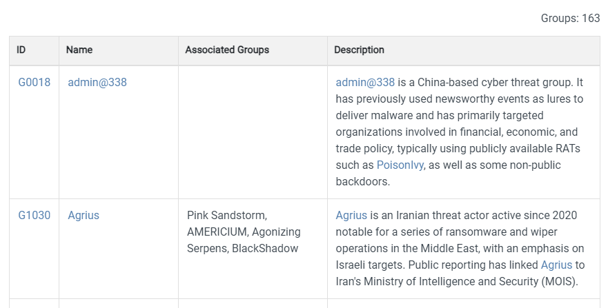

- **ID**: This is the identifier assigned to the group by MITRE. Other services use names based on associated countries, animals, etc.
- **Name**: The group's name.
- **Associated Groups**: A list of additional names or designations associated with the group.
- **Description**: A brief description of the group, including the sectors and countries they target.

### IDENTIFYING POTENTIAL ATTACKER GROUPS
To do this, simply use the "search" function in your browser to list all groups associated with your domain (here: telecommunications).

Then, create a table with the important information seen earlier.

Example:

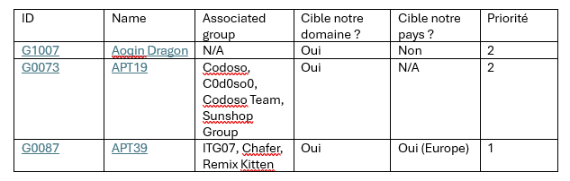

## MATRIX: IDENTIFYING TECHNIQUES USED
Now that the attacker groups are identified and prioritized, simply go to their dedicated page.  
In this article, we will use [G1007](https://attack.mitre.org/groups/G1007/), even though it is not classified as P1 according to our scale.

### UNDERSTANDING THE INFORMATION
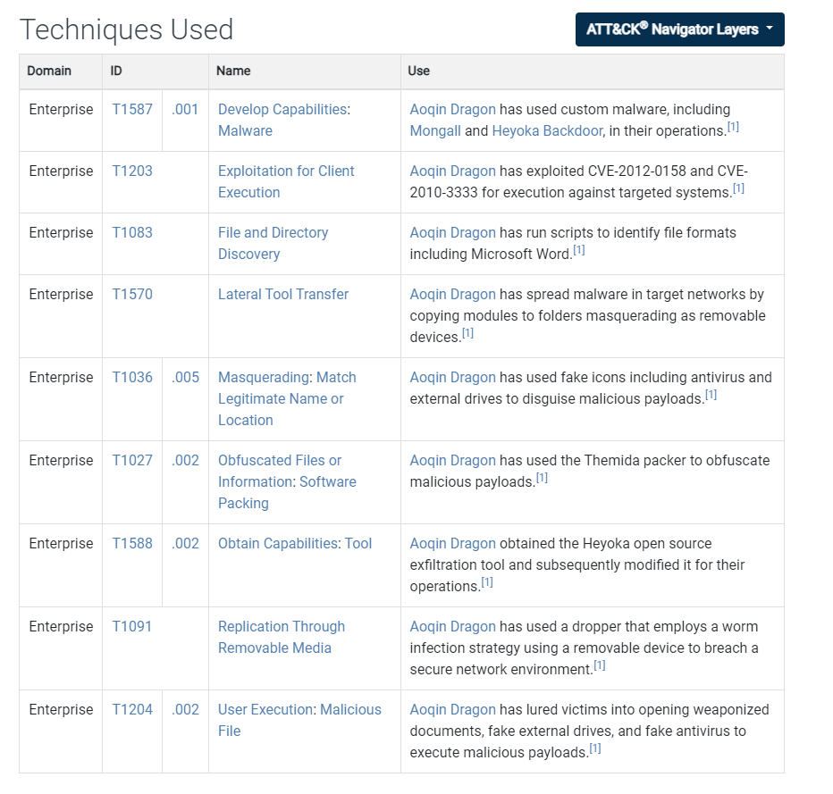

- **Domain**:
  - *Enterprise* includes techniques used for Windows, macOS, Linux, PRE, Office Suite, Identity Provider, SaaS, IaaS, Network, and Containers platforms.
  - *Mobile* includes techniques used against Android and iOS.
  - *ICS* is dedicated to industrial systems.
- **ID**: The techniques represent the "how" an adversary achieves a tactical goal by performing an action. In this case, the first number corresponds to the main technique and the second (after the dot) designates the sub-technique used.
  - Example: *Active Scanning* has three sub-techniques: Scanning IP Blocks, Vulnerability Scanning, and Wordlist Scanning.
- **Name**: The name of the technique.
- **Use**: Use case for the technique.

### IDENTIFYING PROTECTIONS BY TECHNIQUE
Now that you’ve identified what your company is concerned about, it’s necessary to review available protection measures.

For this, select each identified technique and visit its dedicated page.  
You will find a chapter titled:
- **Mitigations**: Contains mitigation measures that can be used to prevent the execution of a technique or sub-technique.
- **Detection**: Contains detection measures that can be used to spot the execution of a technique or sub-technique.

Example of result:

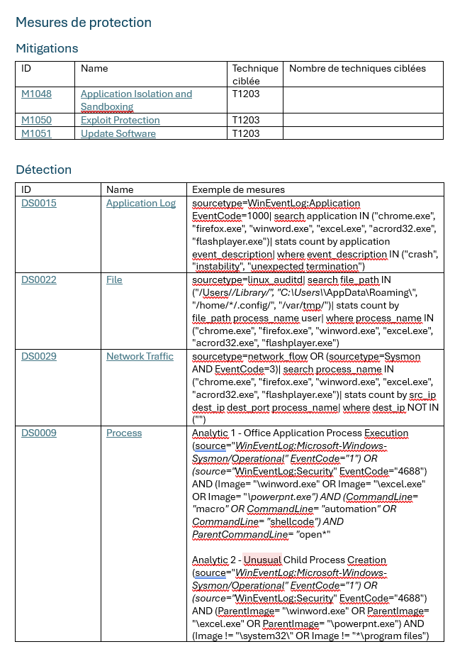

## MATRIX: IDENTIFYING SOFTWARE
On the same page as before, there is also a table dedicated to the software used by attackers.

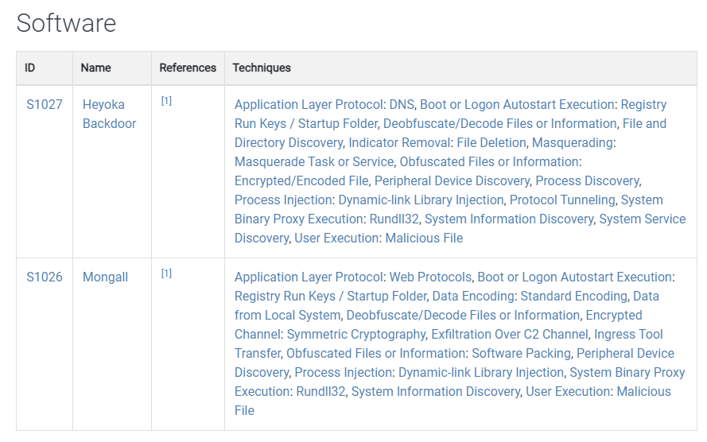

As with techniques, create a dedicated table:

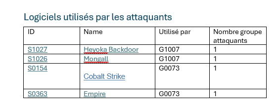

# INDICATOR OF COMPROMISE

Your attackers have been identified.  
Take this opportunity to check the known indicators of compromise (IoCs) for these groups, using:  

- **Public lists** (available on GitHub, for example):  
  Potentially low confidence, but low costs and potentially large quantities.  
- **Paid feeds** (e.g., AlienVault, Unit42, etc.):  
  Relatively high confidence, moderate quantity, but the price can quickly become a barrier.  
- **Governmental feeds / ISACs**:  
  High confidence, but potential difficulties in accessing the data.  

For more information on the lifecycle of IoCs, refer to [RFC9424](https://datatracker.ietf.org/doc/rfc9424/).

## NAVIGATOR: MAPPING
Now that we have some nice tables, it’s time to create a more visual mapping to determine what should be managed as a priority.

For this, we will use [attack-navigator](https://mitre-attack.github.io/attack-navigator/)

### CASE 1: ONE GROUP ONLY
Let’s assume you're in an ideal case where only one group is targeting you (or you’re creating a map dedicated to this attacker in your infrastructure following a compromise).

- Go to the group's dedicated page.
- Click on the "ATT&CK Navigator Layers" button.
- Click on "view".

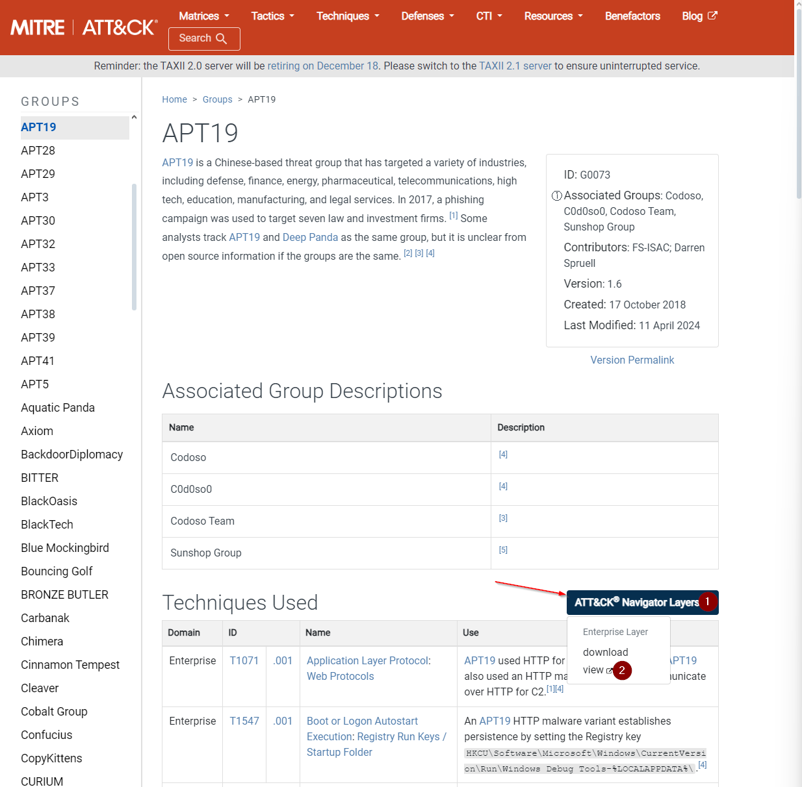

### CASE 2: MULTIPLE GROUPS
- Select "Create New Layer".
- Choose the desired model (enterprise, mobile, ICS).
- Select the magnifying glass icon 
- In the "Threat Group" section, select the groups you previously identified.
- Click on "Layer Controls".
- Click on "layer settings" 
- Fill in the details.

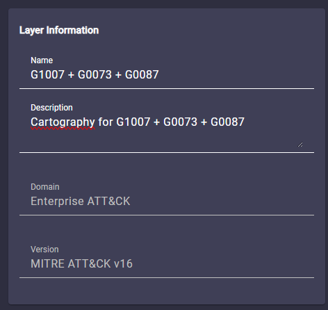

### EXPORTING THE MAP
To export the map you created:
- Select the export button: 
- Choose your unit of measurement (1).
- Select the paper size and orientation (2).
- Choose the information to display (3).
- Start the download (4).

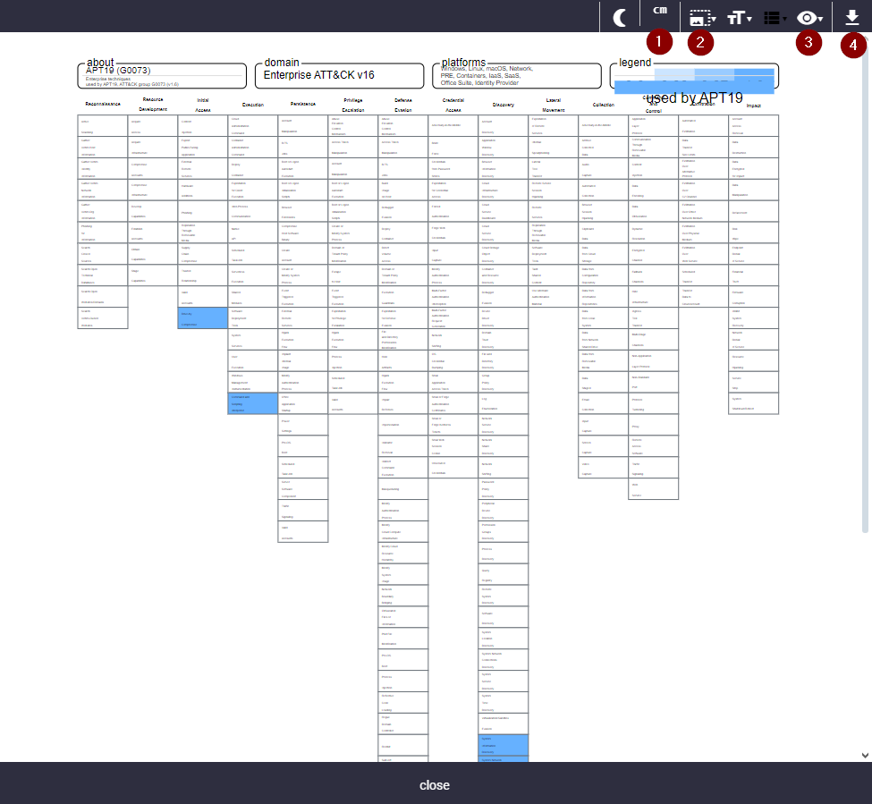

Example result:

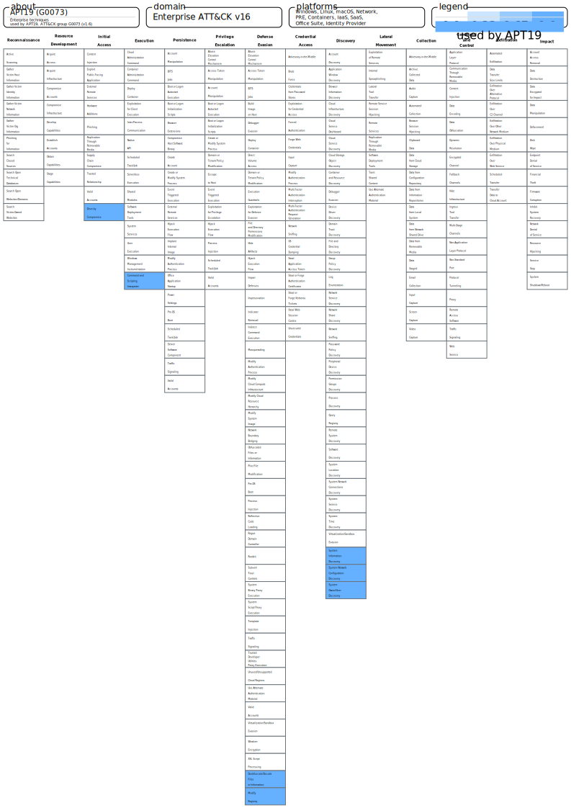

# ATTACK FLOW PROJECT: CREATING THE ATTACK DIAGRAM
The previous table provides a quick view of attack paths, which is ideal for presenting to top management. However, our cybersecurity work must address not only top management but also the technical staff.

To create a more understandable attack diagram, we can rely on [The Attack Flow Project](https://center-for-threat-informed-defense.github.io/attack-flow/ui/).

This project allows you to create attack diagrams and also provides many useful examples for better understanding attack flows.  
The full corpus is available for download on the *Attack Flow* publication page, but individual diagrams can also be viewed online. Each attack flow is provided in several formats (.afb, .json, .dot, .mmd), making it easier to use by different audiences, whether technical or strategic.

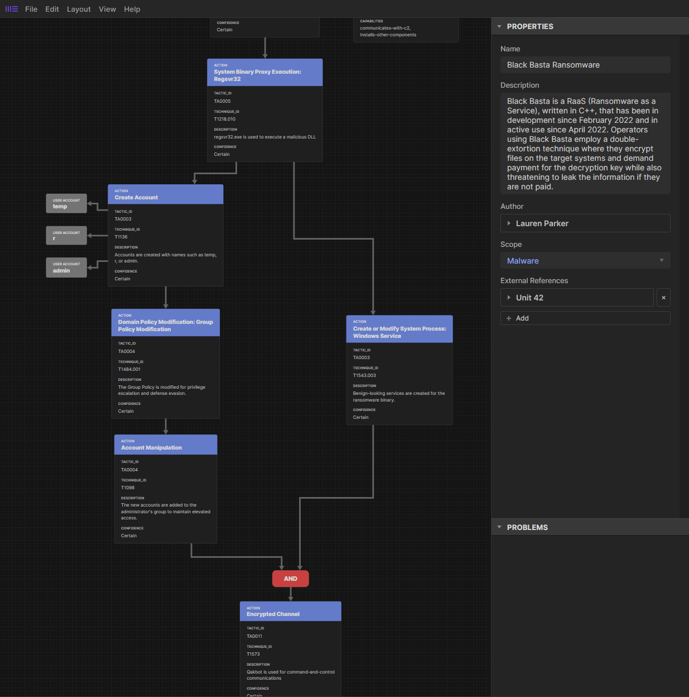

# MITRE D3FEND
## IDENTIFYING POSSIBLE COUNTERMEASURES
Now that the techniques are identified, it’s time to look at possible countermeasures dedicated to your attackers.

Let’s take the previous capture as an example; we see that the attacker is using technique T1203.  
To identify possible protections against this attack, we will consult what MITRE D3FEND tells us.

* Go to the [site](https://d3fend.mitre.org)
* In the upper left section, search for the identified technique (T1203)

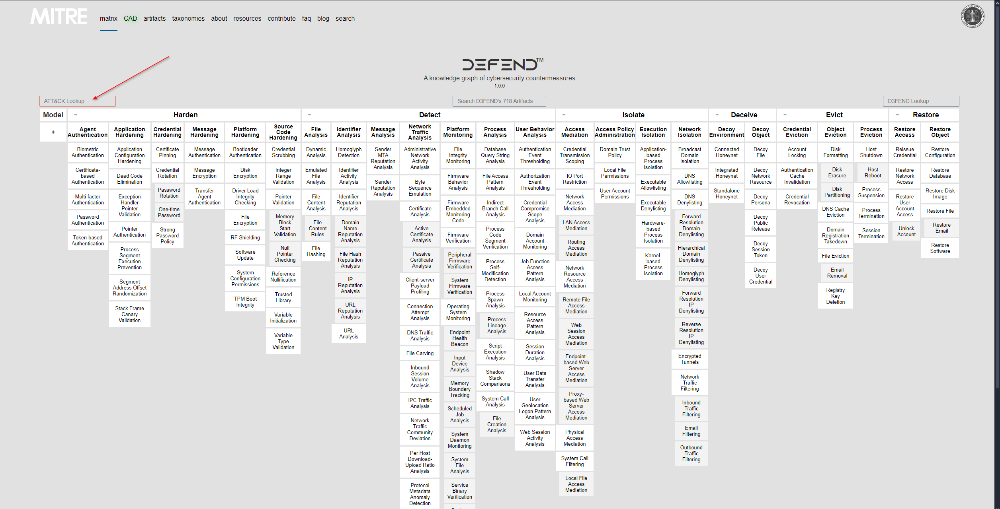

* Enter technique T1203
* Validate

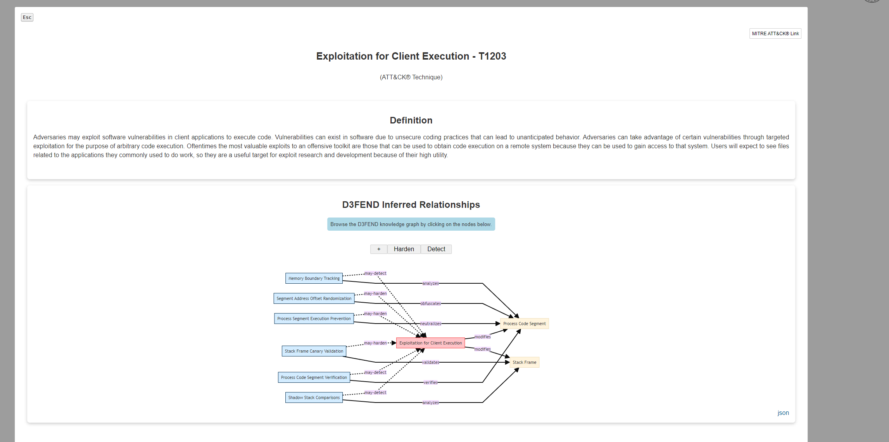

### HARDEN
The hardening tactic aims to make the exploitation of computer networks more costly and less attractive for attackers. Unlike detection, hardening mainly occurs before the system is put online and operational.

The previous diagram is interactive, so you can select only the *Harden* section to identify protections against this technique.

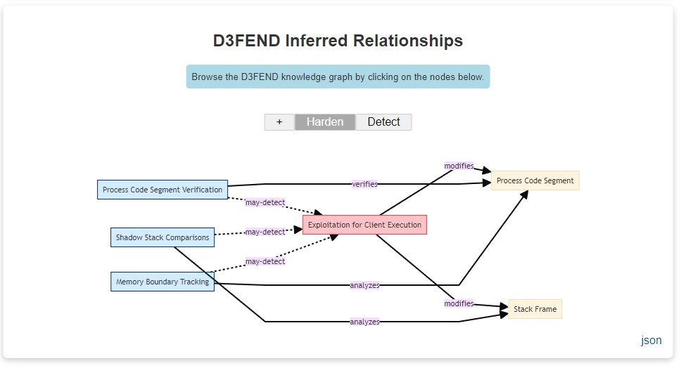

To get more information about each protection, simply click on it.  
Example with "Process Code Segment Verification".

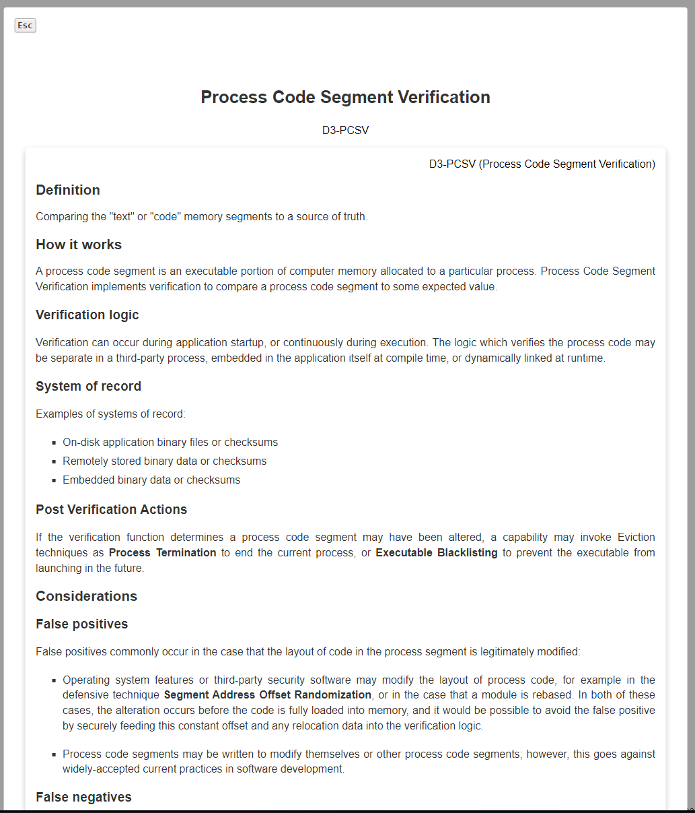

### DETECT
The detection tactic is used to spot adversary access or any unauthorized activity on computer networks.

The process is the same as for the *Harden* section.

### LIMITATIONS
MITRE D3FEND does not necessarily have countermeasures for every technique.

# VERIFY THE CAPABILITIES OF YOUR EDR/XDR

Your company may have an EDR/XDR to protect against attacks. This is a good thing, but a poorly configured EDR/XDR (incomplete deployment, missing or outdated protection modules, overly broad exclusions, etc.) could create a false sense of security, which does not reflect the reality on the ground.

To avoid this danger, two solutions exist.

## MITRE ENGENUITY
MITRE provides an annual evaluation report on EDR/XDR solutions, called [MITRE ENGENUITY](https://attackevals.mitre-engenuity.org).

It is important to note that:
- only voluntary vendors are tested,
- the attack TTPs are known to the vendors.

## CALDERA SOFTWARE: MITRE SIMULATION
## CALDERA SOFTWARE: MITRE SIMULATION
[Caldera](https://caldera.mitre.org) is a cybersecurity framework developed by MITRE that helps professionals save time, money, and energy through automated security assessments.

## CALDERA SOFTWARE : SIMULATION MITRE
Caldera est un framework de cybersécurité développé par MITRE qui permet aux professionnels d'économiser du temps, de l'argent et de l'énergie grâce à des évaluations de sécurité automatisées.

# CVE2CAPEC: CVE AND MITRE MAPPING
Let’s summarize what we have now:
- a list of potential attackers,
- the techniques they use,
- the mitigation and detection solutions for these techniques,
- a better understanding of your EDR/XDR protection capabilities,
- a tool to test your solutions and incident response teams.

One important point is mapping vulnerabilities (CVE) to techniques in MITRE ATT&CK. If you can obtain CVEs that are relevant to your organization, you can better plan defenses by associating them with an identified attack path.
