- [OBJECTIF](#objectif)
  - [ÉTUDES DE CAS](#études-de-cas)
  - [QUID DES MENACES INTERNES ?](#quid-des-menaces-internes-)
- [TABLEAU DES PRIORITÉS](#tableau-des-priorités)
  - [EXEMPLES DE TABLEAU DE PRIORITÉS](#exemples-de-tableau-de-priorités)
    - [Exemple 1 :](#exemple-1-)
    - [Exemple 2 :](#exemple-2-)
    - [Exemple 3 :](#exemple-3-)
- [MITRE ATT\&CK](#mitre-attck)
  - [CTI : RECHERCHER LES GROUPES D'ATTAQUANTS POTENTIELS](#cti--rechercher-les-groupes-dattaquants-potentiels)
    - [COMPRENDRE LES INFORMATIONS](#comprendre-les-informations)
    - [IDENTIFIER LES GROUPES D'ATTAQUANTS POTENTIELS](#identifier-les-groupes-dattaquants-potentiels)
  - [MATRIX : IDENTIFIER LES TECHNIQUES UTILISÉES](#matrix--identifier-les-techniques-utilisées)
    - [COMPRENDRE LES INFORMATIONS](#comprendre-les-informations-1)
    - [IDENTIFIER LES PROTECTIONS PAR TECHNIQUES](#identifier-les-protections-par-techniques)
  - [MATRIX : IDENTIFIER LES LOGICIELS](#matrix--identifier-les-logiciels)
  - [NAVIGATOR : RÉALISER LA CARTOGRAPHIE](#navigator--réaliser-la-cartographie)
    - [CAS 1 : UN SEUL GROUPE](#cas-1--un-seul-groupe)
    - [CAS 2 : PLUSIEURS GROUPES](#cas-2--plusieurs-groupes)
    - [EXPORTER LA CARTOGRAPHIE](#exporter-la-cartographie)
- [ATTACK FLOW PROJECT : RÉALISER LE SCHÉMA D'ATTAQUE](#attack-flow-project--réaliser-le-schéma-dattaque)
- [MITRE D3FEND](#mitre-d3fend)
  - [IDENTIFIER LES CONTRES-MESURES POSSIBLES](#identifier-les-contres-mesures-possibles)
    - [HARDEN](#harden)
    - [DETECT](#detect)
    - [LIMITATIONS](#limitations)
- [VÉRIFIER LES CAPACITÉS DE VOTRE EDR/XDR](#vérifier-les-capacités-de-votre-edrxdr)
  - [MITRE ENGENUITY](#mitre-engenuity)
  - [CALDERA SOFTWARE : SIMULATION MITRE](#caldera-software--simulation-mitre)
- [CVE2CAPEC : MAPPING CVE ET MITRE](#cve2capec--mapping-cve-et-mitre)
- [RAPPORT](#rapport)

# OBJECTIF
Le présent document a pour objectif de vous aider à créer des schémas d’attaques basés sur les cybermenaces pesant sur votre système d’information.  
Pour ce faire, nous utiliserons majoritairement les outils fournis par le MITRE.

## ÉTUDES DE CAS
Vous êtes membre de la cellule de sécurité informatique d’une entreprise de télécommunications française, chargée de la maintenance pour plusieurs clients, dont certaines entités de l’État français. Votre objectif est de détecter les groupes d’attaquants susceptibles de cibler :
- votre domaine et votre entité (pays),
- votre domaine d’activité,
- les domaines de vos clients,
- ainsi que le plus grand nombre possible de secteurs (entreprises, mobile, industriel).

## QUID DES MENACES INTERNES ?
Les menaces internes ne sont pas à exclure. Cependant, il est important de bien commencer quelque part, et plusieurs techniques utilisées par des attaquants de type APT peuvent être reprises par un attaquant interne (bruteforce, connexions anormales, etc.).

# TABLEAU DES PRIORITÉS
Vous trouverez ci-après des exemples de priorisation. Vous êtes libre de définir votre propre système. L’objectif ici est de pouvoir établir un ordre de traitement basé sur des critères clairs et justifiés.

## EXEMPLES DE TABLEAU DE PRIORITÉS
### Exemple 1 :

| Cible                                  | Priorité |
|----------------------------------------|----------|
| Votre secteur d'activité et pays      | 1        |
| Votre secteur d'activité uniquement   | 2        |
| Les domaines de vos clients           | 3        |

**Explication :** Si un groupe d’attaquants cible votre secteur d’activité dans votre pays, il est plus probable qu’il s’en prenne à vous, comparé à un groupe qui cible uniquement le domaine d’un de vos clients.

### Exemple 2 :
| Cible                                  | Priorité |
|----------------------------------------|----------|
| Votre secteur d'activité et pays      | P1       |
| Votre secteur d'activité               | P2       |
| Le secteur d'activité de plusieurs clients | P3    |
| Le secteur d'activité d'un seul client | P4       |
| Lié à un pays ennemi                  | P5       |

**Explication :** Cette matrice apporte une granularité supplémentaire sur les menaces pesant sur vos clients (qui peuvent constituer un vecteur d’attaque à votre encontre) ainsi qu’une dimension géopolitique.

### Exemple 3 :
Vous pouvez également intégrer les domaines ciblés par un attaquant (entreprise, mobile, industriel) pour définir un niveau de priorité en fonction de la menace qu’il représente et de la facilité avec laquelle il pourrait infiltrer votre système d’information.

# MITRE ATT&CK
ATT&CK (pour Adversarial Tactics, Techniques, and Common Knowledge) est une base de connaissance aidant a modeler les tactiques et techniques utilisées par les cyberadversaires, ainsi qu'a comprendre comment les détecter et les stopper

## CTI : RECHERCHER LES GROUPES D'ATTAQUANTS POTENTIELS
- Se rendre sur la page [groups du MITRE ATT&CK](https://attack.mitre.org/groups/)

### COMPRENDRE LES INFORMATIONS
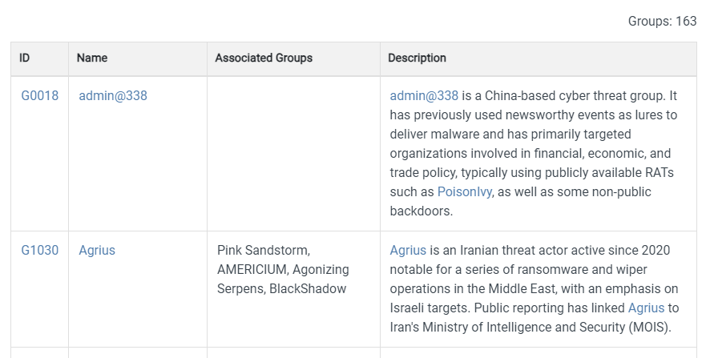

- **ID** : Il s’agit de l’identifiant attribué au groupe par le MITRE. D’autres services utilisent des noms basés sur les pays associés, des animaux, etc.
- **Name** : Nom du groupe.
- **Associated Groups** : Liste des noms ou désignations supplémentaires associés au groupe en question.
- **Description** : Brève description du groupe, incluant notamment les secteurs d’activité et les pays ciblés.

### IDENTIFIER LES GROUPES D'ATTAQUANTS POTENTIELS
Pour cela, il suffit d’utiliser la fonction "recherche" de votre navigateur pour lister tous les groupes associés à votre domaine (ici : télécommunications).

Réalisez ensuite un tableau comportant les informations importantes vues précédemment.

Exemple :

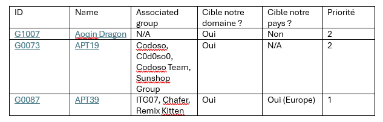

## MATRIX : IDENTIFIER LES TECHNIQUES UTILISÉES
Maintenant que les groupes d’attaques sont identifiés et priorisés, il suffit de se rendre sur leur page dédiée.  
Dans le cadre de cet article, nous utiliserons [G1007](https://attack.mitre.org/groups/G1007/), bien qu’il ne soit pas classé en P1 selon notre échelle.

### COMPRENDRE LES INFORMATIONS
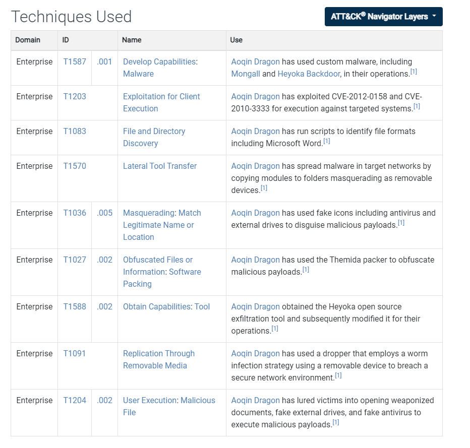

- **Domain** :
  - *Enterprise* contient les techniques utilisées pour les plateformes Windows, macOS, Linux, PRE, Office Suite, Identity Provider, SaaS, IaaS, Network et Containers.
  - *Mobile* contient les techniques utilisées contre Android et iOS.
  - *ICS* est dédié aux systèmes industriels.
- **ID** : Les techniques représentent le "comment" un adversaire atteint un objectif tactique en réalisant une action. Dans ce cas, le premier numéro correspond à la technique principale et le second (après le point) désigne la sous-technique utilisée.
  - Exemple : *Active Scanning* possède trois sous-techniques : Scanning IP Blocks, Vulnerability Scanning et Wordlist Scanning.
- **Name** : Nom de la technique.
- **Use** : Cas d'utilisation.

### IDENTIFIER LES PROTECTIONS PAR TECHNIQUES
Maintenant que vous avez identifié ce que craint votre entreprise, il est nécessaire d'examiner les mesures de protection disponibles.

Pour cela, sélectionnez chacune des techniques identifiées précédemment et rendez-vous sur sa page dédiée.  
Vous y trouverez un chapitre intitulé :
- **Mitigations** : Contient les mesures d'atténuation qui peuvent être utilisées pour empêcher l'exécution d'une technique ou d'une sous-technique.
- **Detection** : Contient les mesures de détection qui peuvent être utilisées pour repérer l'exécution d'une technique ou d'une sous-technique.

Exemple de rendu :

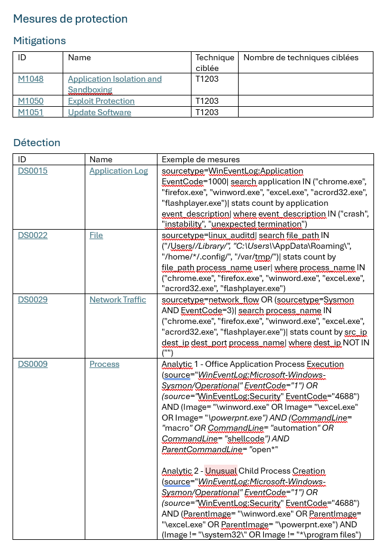

## MATRIX : IDENTIFIER LES LOGICIELS
Sur la même page que précédemment, se trouve également un tableau dédié aux logiciels utilisés par les attaquants.

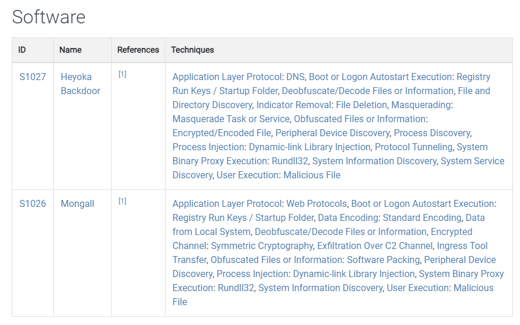

Comme pour les techniques, créez un tableau dédié :

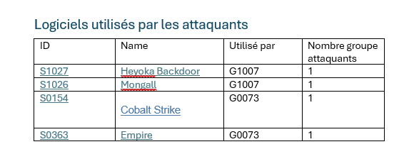

## NAVIGATOR : RÉALISER LA CARTOGRAPHIE
Maintenant que nous avons de très beaux tableaux, il est temps de réaliser une cartographie plus visuelle pour déterminer ce qui doit être géré en priorité.

Pour cela, nous allons utiliser [attack-navigator](https://mitre-attack.github.io/attack-navigator/)

### CAS 1 : UN SEUL GROUPE
Imaginons que vous soyez dans un cas idéal où seul un groupe d’attaquants vous cible (ou que vous réalisiez une cartographie dédiée à cet attaquant dans votre infrastructure suite à une compromission de celle-ci).

- Se rendre sur la page dédiée du groupe.
- Cliquer sur le bouton "ATT&CK Navigator Layers".
- Cliquer sur "view".

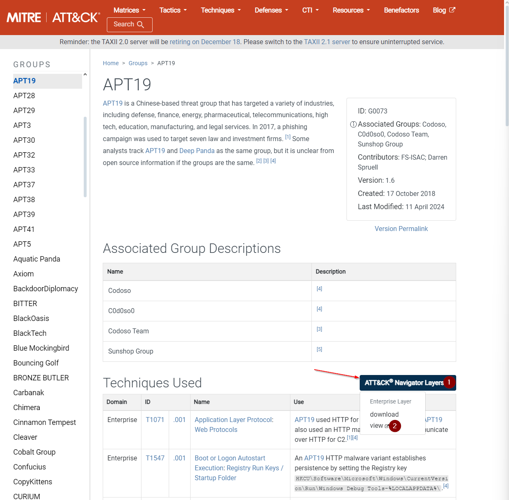

### CAS 2 : PLUSIEURS GROUPES
- Sélectionner "Create New Layer".
- Sélectionner le modèle souhaité (enterprise, mobile, ICS).
- Sélectionner l'icône loupe 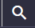
- Dans la partie "Threat Group", sélectionner les groupes précédemment identifiés.
- Cliquer sur "Layer Controls".
- Cliquer sur "layer settings" 
- Remplir les informations.

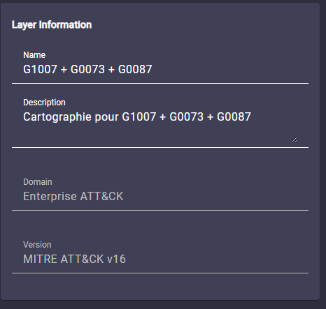

### EXPORTER LA CARTOGRAPHIE
Pour exporter la cartographie réalisée :
- Sélectionner le bouton d'export : 
- Sélectionner votre unité de mesure (1).
- Sélectionner la taille de la feuille et son orientation (2).
- Sélectionner les informations à afficher (3).
- Lancer le téléchargement (4).

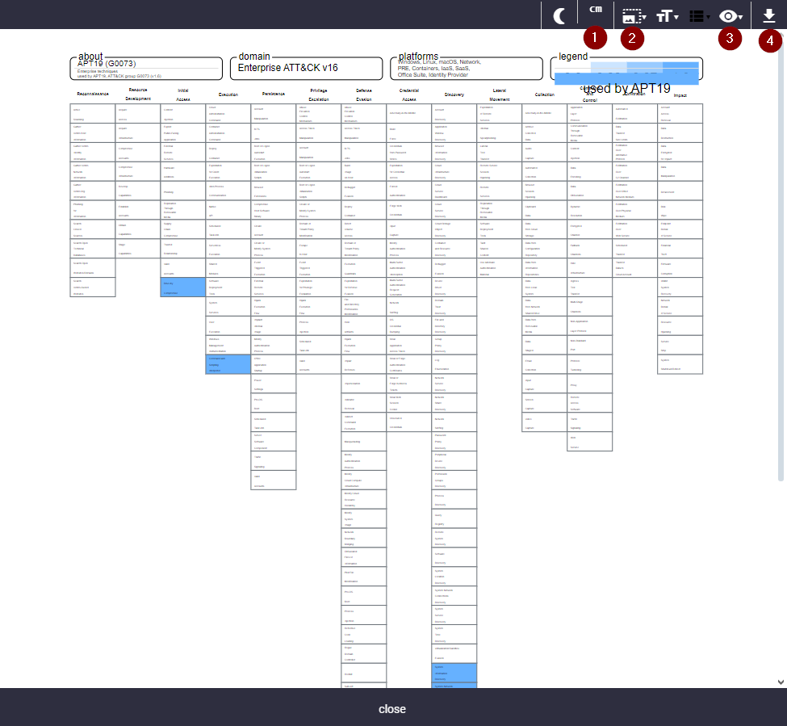

Exemple de rendu :

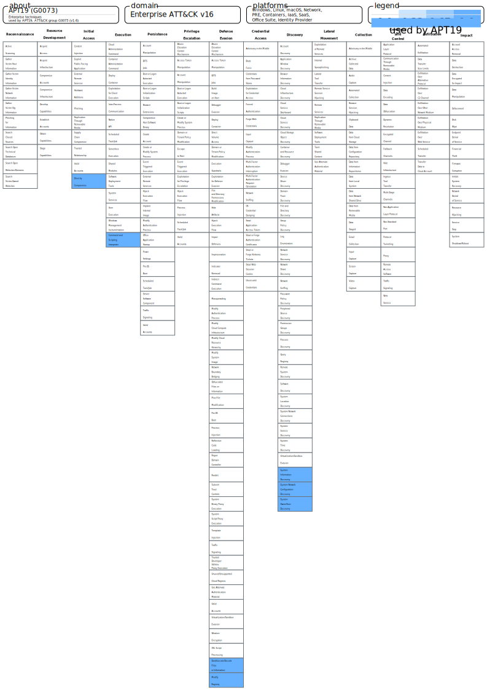

# ATTACK FLOW PROJECT : RÉALISER LE SCHÉMA D'ATTAQUE
Le tableau précédent permet d'avoir une lecture rapide des chemins d'attaque, ce qui est idéal pour une présentation au top management. Cependant, notre travail en cybersécurité doit s'adresser non seulement au top management, mais aussi au personnel technique.

Pour réaliser un schéma d'attaque plus parlant, nous pouvons nous appuyer sur [The Attack Flow Project](https://center-for-threat-informed-defense.github.io/attack-flow/ui/).

Ce projet propose de réaliser des schémas d'attaque, mais fournit aussi de nombreux exemples utiles pour mieux comprendre les flux d'attaque.  
Le corpus complet est téléchargeable depuis la page de publication *Attack Flow*, mais il est également possible de consulter des schémas individuels en ligne. Chaque flux d'attaque est fourni dans plusieurs formats (.afb, .json, .dot, .mmd), facilitant ainsi son exploitation par différents publics, qu'ils soient techniques ou stratégiques.

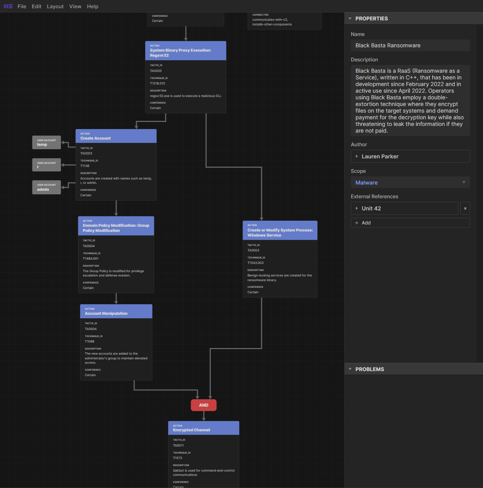

# MITRE D3FEND
## IDENTIFIER LES CONTRES-MESURES POSSIBLES
Maintenant que les techniques sont identifiées, il est temps de regarder les contres-mesures possibles dédiées à vos attaquants.

Prenons en exemple la capture précédente, nous voyons que l'attaquant utilise la technique T1203.  
Pour identifier les protections possibles contre cette attaque, nous allons consulter ce que nous dit MITRE D3FEND.

* Se rendre sur le [site](https://d3fend.mitre.org)
* Dans la partie supérieure gauche, rechercher la technique identifiée (T1203)

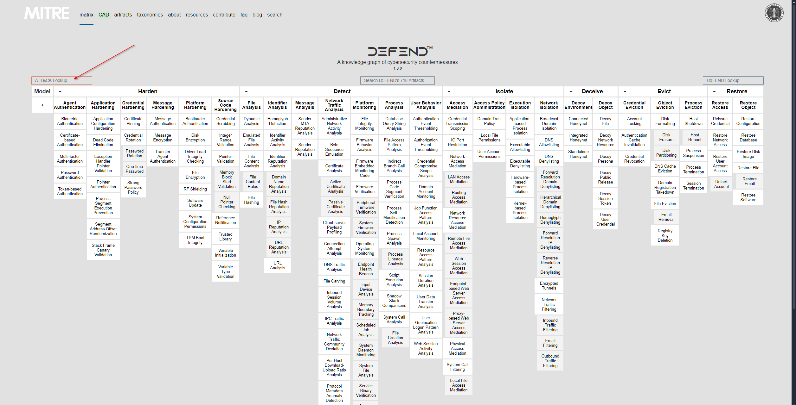

* Saisir la technique T1203
* Valider

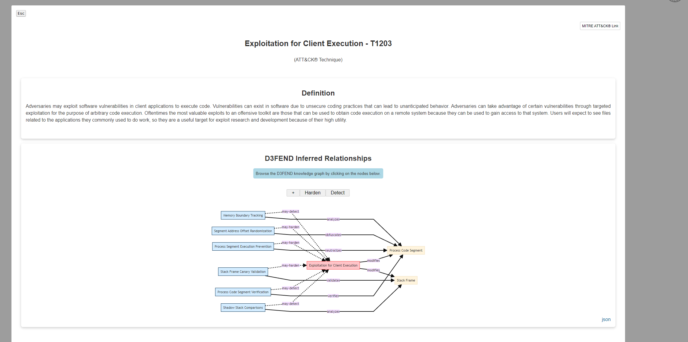

### HARDEN
La tactique de renforcement vise à rendre l’exploitation des réseaux informatiques plus coûteuse et moins attrayante pour les attaquants. Contrairement à la détection, le renforcement s’effectue principalement avant que le système ne soit mis en ligne et opérationnel.

Le schéma précédent est interactif, vous pouvez donc ne sélectionner que la partie *Harden* pour identifier les protections possibles contre cette technique.

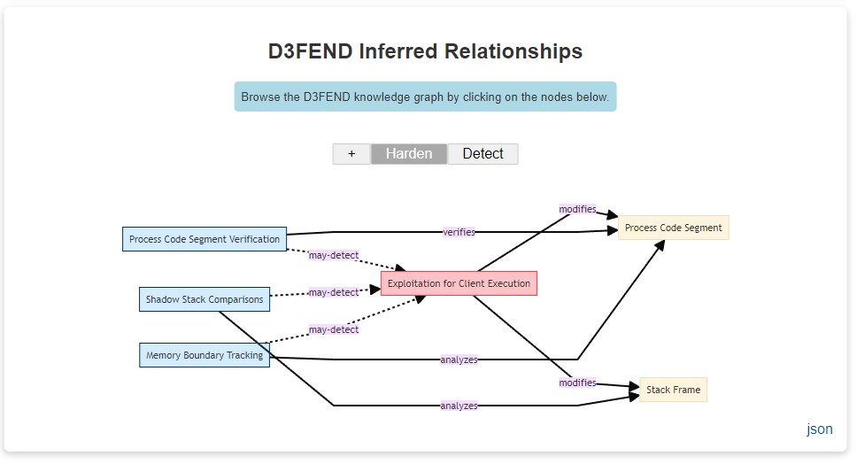

Pour obtenir plus d'informations sur chacune des protections, il vous suffit de cliquer dessus.  
Exemple avec "Process Code Segment Verification".

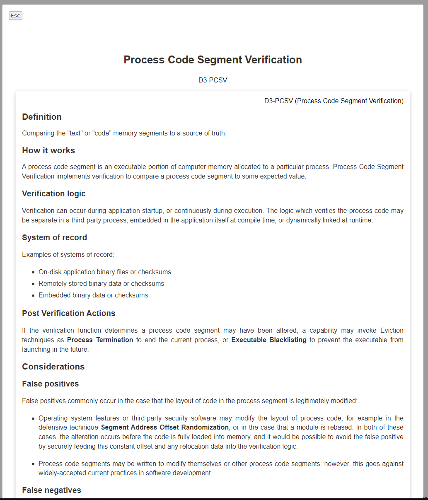

### DETECT
La tactique de détection est utilisée pour repérer les accès des adversaires ou toute activité non autorisée sur les réseaux informatiques.

Le fonctionnement est le même que pour la partie *Harden*.

### LIMITATIONS
Le MITRE D3FEND ne possède pas forcément de contres-mesures pour chaque technique.

# VÉRIFIER LES CAPACITÉS DE VOTRE EDR/XDR

Votre société dispose potentiellement d’un EDR/XDR pour se prémunir des attaques. C’est une bonne chose, mais un EDR/XDR mal configuré (déploiement incomplet, modules de protection absents ou non à jour, exclusions trop larges, etc.) pourrait engendrer un faux sentiment de sécurité, qui ne correspond pas à la réalité du terrain.

Pour éviter ce danger, deux solutions existent.

## MITRE ENGENUITY
Le MITRE fournit chaque année un rapport d'évaluation des solutions EDR/XDR, nommé [MITRE ENGENUITY](https://attackevals.mitre-engenuity.org).

Il est important de prendre en compte que : 
- seuls les éditeurs volontaires sont testés,
- les TTP d’attaque sont connus des éditeurs.

## CALDERA SOFTWARE : SIMULATION MITRE
[Caldera](https://caldera.mitre.org) est un framework de cybersécurité développé par MITRE qui permet aux professionnels d'économiser du temps, de l'argent et de l'énergie grâce à des évaluations de sécurité automatisées. 

  <iframe width="560" height="315" src="https://www.youtube.com/embed/SXmhIFOD9c8" 
          title="Caldera Presentation Video" frameborder="0" 
          allow="accelerometer; autoplay; clipboard-write; encrypted-media; gyroscope; picture-in-picture" 
          allowfullscreen>
  </iframe>

# CVE2CAPEC : MAPPING CVE ET MITRE
Faisons le point sur ce que nous avons maintenant :
- une liste des attaquants potentiels,
- les techniques utilisées par ceux-ci,
- les solutions d’atténuation et de détection pour ces techniques,
- une meilleure connaissance des capacités de protection de votre EDR/XDR,
- un outil pour tester vos solutions et vos équipes de réponse à incidents.

Il reste un point important à prendre en compte : l'existant au sein de votre parc ! Vous avez très probablement des vulnérabilités connues dans votre système d'information.

Dans cette optique, il est utile de générer une liste des CVE connues dans votre parc et de les mapper avec la matrice MITRE ATT&CK pour voir si certaines pourraient être utilisées par les attaquants identifiés précédemment.

Pour ce faire, je vous présente [CVE2CAPEC](https://galeax.github.io/CVE2CAPEC/) et son [dépôt GitHub](https://github.com/Galeax/CVE2CAPEC/).

Avec le score CVSS, la probabilité d'exploitation et ce mapping, vous devriez disposer de suffisamment d'informations pour ordonnancer vos actions de correction.

# RAPPORT
Dans le dossier "report_template", vous trouverez un exemple allégé de rapport généré avec ce type d'informations.